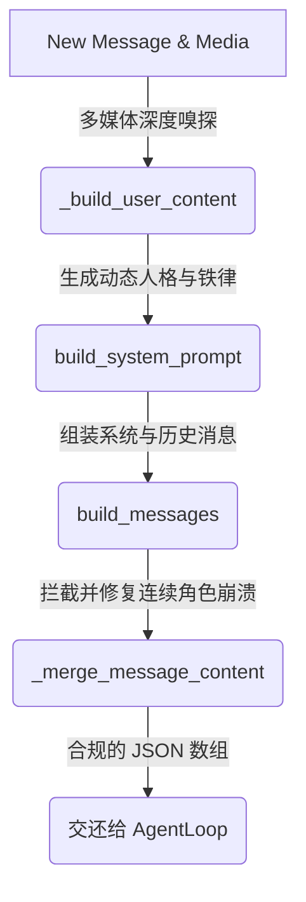

# Nanobot 核心源码精研: `context.py` (防线与装配流水线)

在这篇详细教程中，我们将紧紧贴合 `context.py` 中真实存在的 Python 函数（Functions），模拟一条包含图片和上下文的消息是如何被安全地打包并送入大模型 API 的。

在解析框架中，你可能会认为 Context（上下文）只是单纯的字符串拼接。但通过 **极端场景驱动分析法**，你会发现 `context.py` 实际上是横亘在脆弱的大模型 API 面前的一道“生化防护门”。

---

## 总体生命周期总览 (The Big Picture)

当用户的一条消息和文件被传入 `ContextBuilder` 时，它遵循着严格的“多级安检与装配”漏斗模式：



下面我们将通过真实的极端场景，拆解这些关键函数。

---

## 1. 虚假炸弹探测器: `_build_user_content()`

在多模态（视觉）交互中，处理文件上传是最容易引发血案的环节。

**【真实场景例子】**
某个黑客用户（或者不受信的外部系统）把一个含有恶意代码或乱码的二进制程序重命名成了 `report.png`，并发送给了 Nanobot，要求进行“视觉分析”。

**【源码精讲】**
```python
    def _build_user_content(self, text: str, media: list[str] | None) -> str | list[dict[str, Any]]:
        # ...
        for path in media:
            raw = p.read_bytes()
            # 核心动作：探测真正的 MIME 格式（不轻易相信后缀名）
            mime = detect_image_mime(raw) or mimetypes.guess_type(path)[0]
            
            # 终极防线保护！！！
            if not mime or not mime.startswith("image/"):
                continue # 不是真正的图片？直接静默丢弃！
                
            b64 = base64.b64encode(raw).decode()
            # ... 组装 base64 发给 LLM ...
```

**🔍 设计解读（The Why）**：
* **The "What if it wasn't there?" Trap**: 假如没有 `detect_image_mime(raw)` 这层基于“魔术字节（Magic bytes）”的深度嗅探，程序会傻乎乎地相信 `report.png` 就是图片，然后把整个二进制文件转成数百万字符的 base64 强塞给大模型。这不仅会瞬间烧毁巨量 Token，还会因为文件头解码失败，在 OpenAI/Anthropic 服务端直接引发 HTTP 500 Server Error 导致对话进程当场崩溃。
* **机制总结**：永远不要信任后缀名，在将文件喂给昂贵且脆弱的 LLM API 前，必须在本地进行硬件级的安检截流。

---

## 2. 身份与纪律的奠基者: `build_system_prompt()`

这部分负责装配 System Prompt。为了让 Agent 不至于在不同的操作系统上精神分裂，且不被海量的技能文档撑爆上下文，这里做了双层防护：

**【真实场景例子 1：跨系统幻觉风暴】**
你把 Nanobot 从你的 Mac 电脑上打包，部署到了一台 Windows Server 的云服务器上。大模型因为习惯了 Linux 命令，疯狂向 Windows 终端发送 `ls | grep "log"`，导致连续报错瘫痪。

**【源码精讲 1：平台规则注入】**
```python
    def _get_identity(self) -> str:
        system = platform.system()
        # 探测当前宿主机的真实物理系统
        runtime = f"{'macOS' if system == 'Darwin' else system} {platform.machine()}, Python {platform.python_version()}"

        if system == "Windows":
            platform_policy = """## Platform Policy (Windows)
- You are running on Windows. Do not assume GNU tools like `grep`, `sed`, or `awk` exist.
- Prefer Windows-native commands or file tools when they are more reliable."""
        else:
            platform_policy = """## Platform Policy (POSIX)
- You are running on a POSIX system. Prefer UTF-8 and standard shell tools."""
```
* **解读**：通过动态读取物理机系统，`ContextBuilder` 像一个老练的向导，在每次对话开始前都把当前的生存法则刻印在大模型脑海里。

**【真实场景例子 2：The Context Explosion 上下文撑爆灾难】**
随着 Nanobot 进化，你的 `skills` 文件夹里积攒了 50 个高阶技能，每个文档都有 2000 字长。如果启动时把这 10 万 Token 全塞进 System Prompt，每次问候都会烧掉巨额费用，并且导致大模型“中段失忆”。

**【源码精讲 2：懒加载目录】**
```python
        # 机制：庞大技能库的“黄页目录”提取
        skills_summary = self.skills.build_skills_summary()
        if skills_summary:
            parts.append(f"""# Skills
The following skills extend your capabilities. To use a skill, read its SKILL.md file using the read_file tool.

{skills_summary}""")
```
* **解读**：`build_skills_summary()` 只提取了每个技能的名字和一句话简介。它给大模型发了一本“黄页电话本”，定下规矩：**"你想用哪个技能，就自己去读那个文件。"** 成功将 100,000 Tokens 压缩成轻量级的按需加载索引。

---

## 3. 连续角色崩溃防线: `build_messages()`

这是 `context.py` 中最精彩的异常处理机制。

**【真实场景例子】**
由于网络卡顿，你迅速发送了两句：“第一句话”和“第二句话”。大模型还没来得及回复，消息历史里出现了连续两个 `user`。

**【源码精讲 (分段剖析)】**

#### Step 3.1: 合并检查
```python
    def build_messages(...):
        # 组装当前的 User 内容并注入包含时间的 Runtime Context
        merged = f"{runtime_ctx}\n\n{user_content}"
        
        # ！！！检查大模型 API 禁忌：角色连击 ！！！
        if messages[-1].get("role") == current_role:
            last = dict(messages[-1])
            last["content"] = self._merge_message_content(last.get("content"), merged)
            messages[-1] = last
            return messages
            
        messages.append({"role": current_role, "content": merged})
```

**🔍 设计解读（The Why）**：
* **The "What if it wasn't there?" Trap**: 顶级大模型（如 Claude 和 GPT 严格模式）的 API 严格要求：`roles must alternate between "user" and "assistant"`。如果直接 `append` 连续的 user 消息，会直接引发 HTTP 400 Bad Request 报错。
* 这个设计叫做 **“同态合并补偿”**：与其试图控制外部难以预测的乱序并发，不如在发包的最底端强制执行格式清洗，抹平一切规则冲突。

---

## 4. 架构解惑：对话过长该如何处理？

在研读 `context.py` 后，你可能会疑惑：**这里根本没有判断 `history` 长度的代码，无限闲聊不会爆 Token 吗？**

**【真实场景例子：The Infinite Chat Bomb 无限闲聊炸弹】**
* **架构设计**：`context.py` 里确实没有任何截断逻辑，这是架构上的 **“职责分离”**。组装层不需要懂 Token。
* 真正的流量警察部署在调用它的上游——也就是 `loop.py` 中的 `MemoryConsolidator`：
  ```python
  # loop.py 中的核心拦截
  await self.memory_consolidator.maybe_consolidate_by_tokens(session)
  ```
* 当 Token 阈值快满时，`MemoryConsolidator` 会触发后台任务：唤醒大模型将最老的 50 条消息提炼成一段精简摘要，插入历史顶端，然后删除原始记录。再将这套精简后的干净 `history` 喂给 `ContextBuilder`。

---

## 5. 总结与反思

通过研读 `context.py`，你应该能领悟到“应用层大模型工程”的一个残酷真相：
**你永远不能信任你的用户输入，你也永远不能信任大模型 API 的稳定性。**

1. **`_build_user_content()`**：防住了后缀名欺骗带来的崩溃炸弹。
2. **`build_system_prompt()`**：防住了系统幻觉，并通过“懒加载索引”防住了 Context 撑爆。
3. **`build_messages()`**：防住了连续发包导致的 API 交替规则校验失败。
4. **架构分离**：将历史压缩（Consolidate）与装配剥离，各司其职。

`ContextBuilder` 真正的使命，不是去迎合大模型，而是成为驯服混乱世界的最后一块盾牌。
