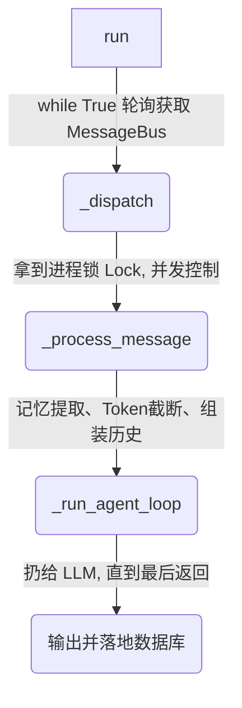

# Nanobot 核心源码精研: `loop.py` (全流程源码实境解析)

在这篇详细教程中，我们将紧紧贴合 `loop.py` 中真实存在的 Python 函数（Functions），模拟一条微信消息从进入 `nanobot` 到完全处理结束的全生命周期。

我们不仅会梳理主干流程，还会结合 **极端场景驱动分析法** 来解答这些函数中那些“令人费解”的保护性代码。

---

## 总体生命周期总览 (The Big Picture)

当你部署了 Nanobot，并且进程启动后，所有的核心运转都集中于 `AgentLoop` 这个类里。
它的流转栈非常清晰，遵循着自上而下的漏斗模式：



下面我们将通过一个真实的例子，拆解这四个关键函数。

---

## 1. 永不停止的收信器: `run()`

**【真实场景例子】**
你在微信里给机器人发了一条信息：“帮我写一首关于秋天的诗”。

此刻，这条消息被包装成了 `InboundMessage` 塞入了系统的内部队列 (MessageBus)。而 `AgentLoop.run()` 函数正如一个不知疲倦的邮递员，一直堵在队列口。

**【源码精讲】**
```python
    async def run(self) -> None:
        self._running = True
        while self._running:
            try:
                # 疯狂从总线拉取刚发进来的消息
                msg = await asyncio.wait_for(self.bus.consume_inbound(), timeout=1.0)
            except asyncio.TimeoutError:
                continue # 没有消息？没关系，接着等。

            # ... 检测是不是内置系统指令 ...

            # 核心动作：抛出一个独立任务去处理它！
            task = asyncio.create_task(self._dispatch(msg))
            # 记录在活跃任务中
            self._active_tasks.setdefault(msg.session_key, []).append(task)
```

**🔍 设计解读（The Why）**：
注意到了吗？它并没有在这儿用 `await self._dispatch(msg)`。它选择了 `asyncio.create_task()` 把处理工作扔到后台。
* **The "What if it wasn't there?" Trap**: 如果使用串行 `await`，那么假如你让机器人去“生成一篇 10000 字的小说”需要转圈 3 分钟，在这 3 分钟内，其他人哪怕只是发一句“你好”也会被完全卡死在队列里，因为邮递员死锁了！有了 `create_task`，系统就支持了跨多人的无限并发。

---

## 2. 乱序防火墙: `_dispatch()`

正因为我们在第一步放开了并发（允许100个任务同时派发），就会引申出巨大的“竞态条件 (Race Condition)”危机。`_dispatch()` 的存在极其关键。

**【真实场景例子】**
你的网络卡了，你快速狂点了两下发送钮，同时向系统发了两个请求进入同一个会话（比如微信），且只相差 0.01 秒。

**【源码精讲】**
```python
    async def _dispatch(self, msg: InboundMessage) -> None:
        """Process a message: per-session serial, cross-session concurrent."""
        
        # 获取针对当前这个聊天窗口(session)的排他锁
        lock = self._session_locks.setdefault(msg.session_key, asyncio.Lock())
        
        # 全局最大并发门流（保护 API Rate Limit)
        gate = self._concurrency_gate or nullcontext()
        
        # ！！！终极防线保护！！！
        async with lock, gate:
            try:
                # 拿到了聊天窗口使用权，再开始真正调用逻辑
                response = await self._process_message(...) 
```

**🔍 设计解读（The Why）**：
* **The "What if it wasn't there?" Trap**: 假如没有 `async with lock:`，由于第一步是异步的，两句消息并发唤死了 `_process_message`，它们同时读取历史记录，同时推演，导致大模型混乱报错或者是互相覆盖记忆。
* 这是非常精湛的隔离模型：**同一个会话强制串行单步走，不同的人/不同群的会话无锁全速并发。**

---

## 3. 会话重组大师: `_process_message()`

拿到了该群聊的执行权后，正式进入实质性的执行阶段。这个函数是全篇最长的，它像个精密的流水线工人：

**【真实场景例子】**
在你问“昨天的日志帮我分析了吗？”时，系统要想不崩，得先看看昨天聊了什么，还得提防你是不是打断了机器人。

**【源码精讲 (分段剖析)】**

#### Step 3.1: 亡羊补牢机制 Checkpoint
```python
        session = self.sessions.get_or_create(key)
        # 第一阶段：意外断电恢复！
        if self._restore_runtime_checkpoint(session):
            self.sessions.save(session)
```
* **The "What if it wasn't there?" Trap**: 昨晚系统正调着你的网盘工具准备搜索，突然服务器停电了！LLM的对话记录停留在了“准备运行寻找盘口_tool”。今天你又说话了，如果没有被 `_restore_runtime_checkpoint` 处理回填补全（伪造一个中断报错结果发给模型闭环），OpenAI 服务器会因消息协议不完整直接拒绝访问并崩溃（返回 HTTP 400 Bad Request）。

#### Step 3.2: 压缩记忆与整理行李
```python
        # 第二阶段：防止大脑撑爆
        await self.memory_consolidator.maybe_consolidate_by_tokens(session)
```
* `maybe_consolidate_by_tokens` 就是调用前面提过的 `Memory` 滑窗。此时检查历史 Token 是不是快撑满限制了，如果撑满了，就主动拦截，先去向另一个 LLM 要个浓缩摘要，抛弃最早聊天内容。确保接下来的对话 100% 畅通无阻，避免抛出 Token Limit Error。

#### Step 3.3: 激战开始！
```python
        # 第三阶段：进入大模型循环战局
        final_content, _, all_msgs = await self._run_agent_loop(...)
        if final_content is None or not final_content.strip():
            final_content = EMPTY_FINAL_RESPONSE_MESSAGE
```
* 到这里才终于把准备好的历史数据打包成了 `all_msgs`，交给大名鼎鼎的 `_run_agent_loop`。这个函数会一头扎进我们在看 `runner.py` 时的裸 LLM 迭代，反复在 API、判断是否需要工具、工具执行 间跳跃。

#### Step 3.4: 安全卸装与打扫
```python
        # 第四阶段：保存新出的记录、打猎归来
        self._save_turn(session, all_msgs, 1 + len(history)) # 持久化到 DB/本地文件
        self._clear_runtime_checkpoint(session)              # 擦除亡羊补牢用的 Checkpoint
        self.sessions.save(session)
        
        # 开始打包最后能发出去的结构体交还给微信
        return OutboundMessage(
            channel=msg.channel, chat_id=msg.chat_id, content=final_content,
        )
```
* 注意 `_save_turn()` 也是极其小心翼翼的。模型运行工具后，可能拉取到几万字的文档（比如网络爬虫抓了一整个页面的 HTML）。为了不把会话弄崩，这步会有代码 `if len(content) > self.max_tool_result_chars: truncate_text(...)`，一旦模型查到的文字太啰嗦直接强行切断。

---

## 4. 总结与反思

通过 `loop.py`，你看出来了吗？真正的核心 AI 代码几乎并不是用来写 "Prompt 请求"的，**90% 都在写外围防御：**

1. **`run()`** 挡在了前面：防住了串行带来的阻塞饿死。
2. **`_dispatch()`** 挡在了前面：防住了乱序多发带来的竞争风暴崩溃。
3. **`_process_message()`** 挡在了前面：防住了突然断电带来的 LLM API Schema 撕裂错误(`checkpoint`)，防住了长长久久聊天导致的炸 Token 问题(`consolidator`)，防住了工具返回过大导致的日志崩盘污染(`save_turn`)。

当这些铜墙铁壁都架好之后，最深处的 `_run_agent_loop()` 才能安心地只干一件事：“嘿模型，工具运行完了，下一步要干嘛？”。
