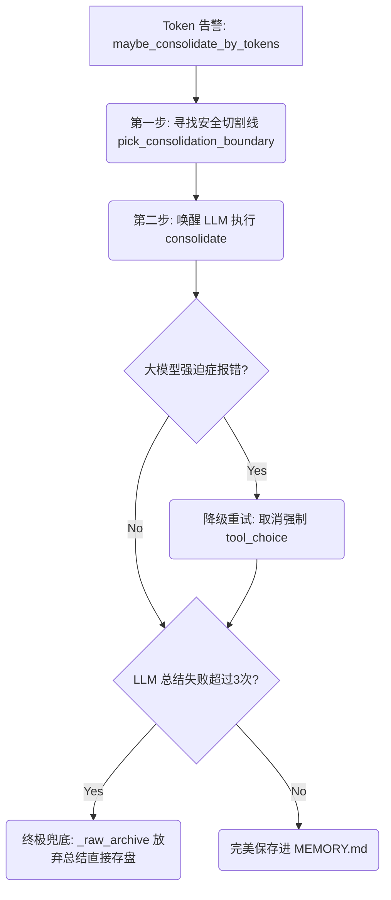
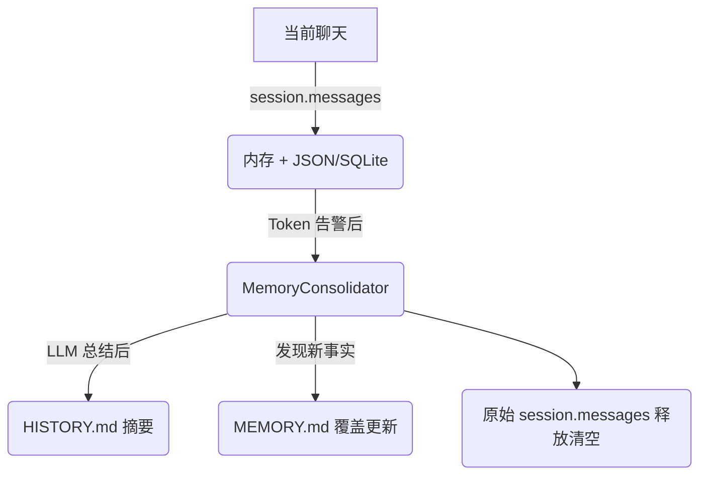

# Nanobot 核心源码精研: `memory.py` (清道夫与档案管理员)

在这篇教程中，我们将紧贴 `memory.py` 源码，探索当大模型的 Token 上下文见顶时，系统是如何通过**记忆压缩引擎** (Memory Consolidation) 安全、无损地精简聊天记录的。

如果说 `ContextBuilder` 是前端无条件拼接的组装线，那么 `MemoryConsolidator` 就是后端的“清道夫”与“交通警察”。

---

## 宏观生命周期总览 (Lifecycle Overview)

当 `loop.py` 发现会话 Token 即将见顶时，它会唤醒 `memory.py` 进行历史压缩。这个过程充满着对异常边缘场景的层层设防：



下面我们将通过真实的极端场景，拆解这些核心机制。

---

## 1. 不可撕裂的切割线: `pick_consolidation_boundary()`

当系统的 Token 被撑爆，我们必须要删除一部分旧记录，但这绝不能是“一刀切”。

**【源码精讲】**
```python
    def pick_consolidation_boundary(self, session: Session, tokens_to_remove: int):
        # ...
        for idx in range(start, len(session.messages)):
            message = session.messages[idx]
            
            # 核心动作：切割线必须永远停留在 "user" 的回合边界
            if idx > start and message.get("role") == "user":
                last_boundary = (idx, removed_tokens)
                if removed_tokens >= tokens_to_remove:
                    return last_boundary
```

**🔍 设计解读（The Why）**：
* **The "Torn Message" Trap (撕裂对话陷阱)**：系统需要删掉历史里最古老的 1000 个 Tokens。凑巧，这第 1000 个 Token 落在了一次工具调用 (`tool_call`) 的中间，或者切断了机器人上一句话的一半。大模型的 API 对历史对话格式极其苛刻（比如有 tool_call 就必须有 tool_result），一旦这样切分，底层直接返回 400 Bad Request。
* **机制总结**：代码绝对不允许在任意地方截断。它只会寻找 `role == "user"` 的消息，以此作为安全的切割锚点。这确保了丢给总结大模型的历史切片永远是“结构完整”的对话回合。

---

## 2. 固执大模型的强制降级: `consolidate()`

为了让大模型老老实实输出 JSON，代码最初强行锁死了它只能用 `save_memory` 这个工具。

**【源码精讲】**
```python
            # 第一波：强迫它必须调用 save_memory
            response = await provider.chat_with_retry(
                tool_choice={"type": "function", "function": {"name": "save_memory"}}
            )

            # 核心防御：它敢报错不支持强制调用？立刻滑跪降级！
            if response.finish_reason == "error" and _is_tool_choice_unsupported(response.content):
                logger.warning("Forced tool_choice unsupported, retrying with auto")
                response = await provider.chat_with_retry(
                    tool_choice="auto", # 降级为 auto
                )
```

**🔍 设计解读（The Why）**：
* **The "Stubborn LLM" Trap (固执大模型拒载)**：你心血来潮把大模型换成了某个开源的私有化模型或较旧的 API 渠道。恰好，这个渠道的 API 尚未支持 `tool_choice="forced"` 语法。如果没有这行探测代码，整个压缩任务会瞬间崩盘。
* **机制总结**：一旦检测到模型抛出了 `tool_choice` 相关的报错，它会立刻“认怂降级”，把强制调用改为 `auto`（让大模型自己看着办），再发一次请求。完美兼容了生态内良莠不齐的 LLM API 规范。

---

## 3. 宁留丑文，不丢寸金: `_fail_or_raw_archive()`

如果在总结历史时，大模型彻底“疯了”怎么办？

**【源码精讲】**
```python
    def _fail_or_raw_archive(self, messages: list[dict]) -> bool:
        self._consecutive_failures += 1
        # 如果重试不到 3 次，继续让大模型尝试
        if self._consecutive_failures < self._MAX_FAILURES_BEFORE_RAW_ARCHIVE:
            return False
            
        # 终极兜底防线保护！！！
        self._raw_archive(messages)
        self._consecutive_failures = 0
        return True

    def _raw_archive(self, messages: list[dict]) -> None:
        # 终极降级方案：直接把 JSON 字典里的内容粗暴写入硬盘
        self.append_history(f"[{ts}] [RAW] {len(messages)} messages\n{self._format_messages(messages)}")
```

**🔍 设计解读（The Why）**：
* **The "Infinite Error Loop" Trap (无限报错死局)**：API 服务商宕机了，或者是长历史里有什么特殊的符号导致总结大模型连续三次死活不肯调出 JSON 工具。如果一直死循环，这块“长脂肪”永远割不掉，系统彻底瘫痪。
* **机制总结**：既然智能 AI 罢工了，系统立刻退化成“笨蛋模式”。如果重试失败达到 `3` 次，它会彻底放弃要求大模型总结，而是用纯 Python 把这 10 几条聊天记录直接转成干巴巴的纯文本字符串，追加存进硬盘的 `HISTORY.md` 中。
* **核心哲学**：**绝对、永远不丢失用户的任何数据**。虽然退化成纯文本意味着这段记忆不再优雅，但它依然留在了硬盘上，保证了未来依然可以通过 `grep` 工具被找回。

---

## 总结与反思

通过 `memory.py` 我们可以看到，真正用于提示词 Prompt 的业务逻辑（即命令 LLM 总结对话）只有寥寥数行，其余 80% 的代码都在做：

1. **结构防护**：保证上下文不被恶意或无意撕裂（`pick_consolidation_boundary`）。
2. **生态兼容**：预判底层服务商可能抛出的语法限制异常（`_is_tool_choice_unsupported`）。
3. **熔断与降级**：即便在所有 AI 机制全部失效的情况下，依然留有一手最原始纯粹的代码逻辑来守住最后底线（`_raw_archive`）。

优秀的 Agent 永远会为智能失效的那一刻准备好退路。

---

## 深度追问：架构全景解析 (Q&A)

### Q1：`MEMORY.md` 与 `HISTORY.md` 的区别是什么？

`MemoryStore` 的注释已经给了答案：`Two-layer memory`（双层记忆）。

| 文件 | 写入方式 | 存什么 | 何时被读 |
|---|---|---|---|
| `MEMORY.md` | **覆盖式写入** (`write_text`) | 全局长时事实：用户偏好、项目核心设定等 | 每轮对话都被注入进 System Prompt |
| `HISTORY.md` | **追加式写入** (`append`) | 日期时间戳 + 对话摘要流水账 | 大模型主动用 `grep` 工具查找 |

用人类作类比：
- **`MEMORY.md`** = 你关于这个人的**三观与知识库**（刻在大脑深处，每次见面前都会默默提醒你）。
- **`HISTORY.md`** = 你的**工作日记本**（翻出来找历史事件时才用，不用背）。

---

### Q2：一段对话的原始历史记录存在哪里？

活跃对话不是存在 `MEMORY.md` 里的，它经历了三个阶段：



1. **Hot Memory（热内存）**：当前正在进行的聊天以 `session.messages` 的形式存放在 Python 内存中，并同时持久化到本地硬盘（JSON/SQLite），防止断电丢失。
2. **Archive（归档）**：当 Token 告警触发时，旧消息被 LLM 消化成摘要追加到 `HISTORY.md`，然后从内存列表中**彻底删除**。
3. **Long-term Facts（长时事实）**：如果摘要中发现了需要长期记住的事实，则会同步更新 `MEMORY.md`。

---

### Q3：`MEMORY.md` 在什么情况下进行更新？

`MEMORY.md` 的更新分为**两条独立的触发路径**：

**路径一：被动触发（Token 见顶时的后台自动流水线）**
触发源头是 `maybe_consolidate_by_tokens`。总结完成后，底层代码在 `consolidate()` 方法的 L191 行做了严格的判断：
```python
# 只有当大模型吐出的内容与旧内容不一致时，才覆盖写入
if update != current_memory:
    self.write_long_term(update)
```
大模型被要求："保留现有事实并加入新事实。如果没有新东西，原样返回。" 只有真的有新事实时才会触发覆盖写盘。

**路径二：主动触发（大模型的主观意愿直接写文件）**
在 System Prompt 中，机器人被明确告知 `MEMORY.md` 文件的路径和权限：
```python
f"- Long-term memory: {workspace_path}/memory/MEMORY.md (write important facts here)"
```
当你说 "请把这个结论存入你的长期记忆" 时，机器人不需要等 Token 爆表，它可以直接调用文件写入工具主动更新 `MEMORY.md`。

---

### Q4：`save_memory` 函数在哪里？为什么找不到？

**它根本不是一个真实的 Python 函数**，这是一个核心的工程设计模式：**基于 Tool Calling 的结构化输出强制截获 (Structured Output via Tool Calling)**。

代码在 `_SAVE_MEMORY_TOOL` 里定义了一个虚假工具 Schema 并传给大模型，目的不是让大模型真正调用某个函数，而是**强迫大模型把内容按 JSON 格式输出**（包含 `history_entry` 和 `memory_update` 两个字段）。

真正的执行逻辑是在 `consolidate()` 里**手动解剖**大模型返回的 JSON 并落盘的：
```python
# 手动拆解 LLM 返回的虚假工具调用 JSON
args = _normalize_save_memory_args(response.tool_calls[0].arguments)
entry = args["history_entry"]   # → 写进 HISTORY.md
update = args["memory_update"]  # → 覆盖写入 MEMORY.md（如果有变化）
```

---

### Q5：memory.py 的本质是什么？一句话总结

> **`memory.py` 是 Nanobot 的"长时记忆基础设施"。**
> - **`MemoryStore`**（存储层）：负责读写 `MEMORY.md`/`HISTORY.md`，始终运行，与 Token 无关。
> - **`MemoryConsolidator`**（压缩层）：负责在 Token 接近上限时，将旧对话历史"消化"进上述文件，按需触发。

两者分工明确：一个管"存"，一个管"压"。
