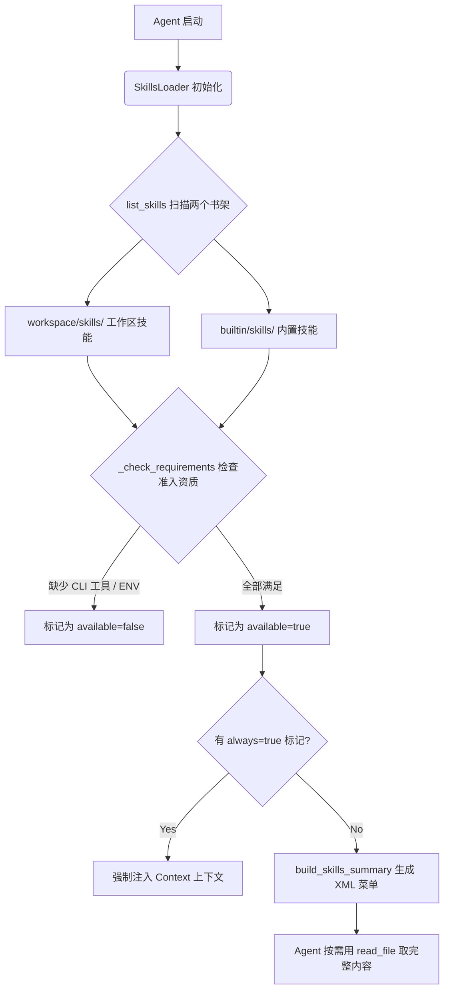

# Nanobot 核心源码精研: `skills.py` (技能书馆员)

在这篇教程中，我们将紧贴 `skills.py` 源码，探索 Agent 是如何**动态发现、加载、过滤**技能（Skills）的。

如果说 `runner.py` 是 Agent 的手，`memory.py` 是 Agent 的记忆，那么 `skills.py` 就是 Agent 的**技能书馆员**。它管理着两个书架——工作区专属技能（workspace）和系统内置技能（builtin）——并且在每次 Agent 上岗前，帮它整理好当前环境"能用哪些书、哪些书被锁住了"的完整清单。

---

## 宏观生命周期总览 (Lifecycle Overview)



`SkillsLoader` 的核心理念是**渐进式加载（Progressive Loading）**：先给 Agent 一份轻量的 XML 菜单（只有名字和描述），Agent 根据任务需要再自行读取完整的 `SKILL.md` 内容，极大节省了 Token 消耗。

---

## 1. 双书架与优先级: `list_skills()` (L26-L57)

**【源码精讲】**
```python
# 1. 优先扫描工作区书架
if self.workspace_skills.exists():
    for skill_dir in self.workspace_skills.iterdir():
        skill_file = skill_dir / "SKILL.md"
        if skill_file.exists():
            skills.append({"name": skill_dir.name, "path": str(skill_file), "source": "workspace"})

# 2. 再扫描内置书架，但已存在同名技能的直接跳过
if self.builtin_skills and self.builtin_skills.exists():
    for skill_dir in self.builtin_skills.iterdir():
        skill_file = skill_dir / "SKILL.md"
        if skill_file.exists() and not any(s["name"] == skill_dir.name for s in skills):
            skills.append({"name": skill_dir.name, ...})
```

**🔍 设计解读（The Why）**：

* **The "Rogue Override" Trap（恶意覆盖陷阱）**：内置技能 `git_helper` 是一个官方维护的工具，但某个项目团队为了让 Agent 遵守自己的 Git 规范，在工作区里也放了一个同名的 `git_helper` 技能。如果没有这段"先到先得"的逻辑，系统可能会错误地用官方版本覆盖项目版本，悄无声息地忽略了团队的自定义规则。
* **机制总结**：工作区技能永远比内置技能优先。内置技能只在"同名的工作区技能不存在时"才会被收录进清单，实现了用户定制化覆盖的能力。

---

## 2. 技能准入门卫: `_check_requirements()` (L177-L186)

**【源码精讲】**
```python
def _check_requirements(self, skill_meta: dict) -> bool:
    requires = skill_meta.get("requires", {})
    # 检查必需的 CLI 命令
    for b in requires.get("bins", []):
        if not shutil.which(b):    # 相当于在 shell 里跑 `which docker`
            return False
    # 检查必需的环境变量
    for env in requires.get("env", []):
        if not os.environ.get(env):
            return False
    return True
```

**🔍 设计解读（The Why）**：

* **The "Ghost Skill" Trap（幽灵技能陷阱）**：系统里有一个 `docker_manager` 技能，看起来功能强大。Agent 满心欢喜地把它告诉给 LLM，但用户的电脑上根本没有装 Docker。LLM 兴奋地生成了一堆 `docker run ...` 指令，结果全部返回 `command not found`，不仅浪费 Token，还把用户弄得一头雾水。
* **机制总结**：`shutil.which()` 就是 Python 版的 `which` 命令。每个技能可以在 YAML 元数据里声明自己依赖哪些二进制工具（`bins`）和环境变量（`env`）。门卫会在 Agent 上岗前逐一核验——缺任何一项，这个技能就不会出现在 Agent 的菜单里，彻底杜绝了"幽灵技能"的出现。

**【Input / Output 追踪直击】**

* **➡️ 技能声明 (SKILL.md 元数据)**: `requires: {bins: ["docker"], env: ["DOCKER_TOKEN"]}`
* **💥 环境核验**: `shutil.which("docker")` 返回 `None`（未安装）
* **⬅️ 准入结果**: `available="false"`，且 XML 菜单里标注 `<requires>CLI: docker</requires>`

---

## 3. Agent 的公告栏: `build_skills_summary()` (L101-L140)

这是 `skills.py` 最核心的对外接口，它生成一份 XML 格式的技能清单，注入进 Agent 的系统 Prompt。

**【源码精讲】**
```python
lines = ["<skills>"]
for s in all_skills:
    available = self._check_requirements(skill_meta)
    lines.append(f"  <skill available=\"{str(available).lower()}\">")
    lines.append(f"    <name>{name}</name>")
    lines.append(f"    <description>{desc}</description>")
    lines.append(f"    <location>{path}</location>")

    # 对不可用技能，额外标注缺少什么
    if not available:
        missing = self._get_missing_requirements(skill_meta)
        lines.append(f"    <requires>{escape_xml(missing)}</requires>")
    lines.append("  </skill>")
lines.append("</skills>")
```

**🔍 设计解读（The Why）**：

* **The "Overwhelming Context" Trap（上下文撑爆陷阱）**：系统里有 20 个技能，每个 `SKILL.md` 都有 100 行详细说明。如果一次性全部塞进 System Prompt，光技能说明书就要用掉数千个 Token，还没开始干活 LLM 就喘不过气了。
* **机制总结**：公告栏只贴简介（名字 + 一句话描述 + 文件路径），Agent 读完清单后，用 `read_file` 工具**按需**去取某个技能的完整 `SKILL.md`。这就是"渐进式加载"的精髓：**先看菜单，再点菜，不要把整个厨房搬到桌上**。

---

## 4. 去掉包装纸: `_strip_frontmatter()` (L161-L167)

**【源码精讲】**
```python
def _strip_frontmatter(self, content: str) -> str:
    if content.startswith("---"):
        match = re.match(r"^---\n.*?\n---\n", content, re.DOTALL)
        if match:
            return content[match.end():].strip()
    return content
```

**🔍 设计解读（The Why）**：

* **The "Metadata Leaking" Trap（元数据泄漏陷阱）**：一个技能文件头部有一段 YAML 元数据块，里面全是给机器读的配置（`requires: bins: [...]`）。如果不剥掉这个外壳就直接把 `SKILL.md` 塞给 LLM，LLM 看到的第一段内容就是乱七八糟的 YAML，不仅浪费 Token，还可能干扰 LLM 对指令的理解。
* **机制总结**：用 `re.DOTALL` 标志让 `.` 能匹配换行符，再用贪心最短匹配 `.*?` 精准捕获两个 `---` 之间的所有 YAML 内容，一刀切掉，让 LLM 只看到纯净的 Markdown 教程正文。

---

## 5. 强制上岗的常驻技能: `get_always_skills()` (L193-L201)

**【源码精讲】**
```python
def get_always_skills(self) -> list[str]:
    result = []
    for s in self.list_skills(filter_unavailable=True):
        meta = self.get_skill_metadata(s["name"]) or {}
        skill_meta = self._parse_nanobot_metadata(meta.get("metadata", ""))
        # 支持两种写法: nanobot 元数据里的 always，或者 YAML 顶层的 always
        if skill_meta.get("always") or meta.get("always"):
            result.append(s["name"])
    return result
```

**🔍 设计解读（The Why）**：

* **The "Mission Critical Forget" Trap（关键技能遗忘陷阱）**：有一个 `git_safety` 技能，规定了代码仓库的所有 Git 操作规范，属于团队最重要的约定法典。但 LLM 根据任务内容分析了一圈，觉得"这次只是读文件，不需要 Git 技能"，于是没有去加载它。结果 Agent 在某个环节误操作强推了一个分支。
* **机制总结**：在 `SKILL.md` 的元数据里设置 `always: true`，相当于给这个技能颁发了"永久通行证"。无论任务是什么，系统都会在 Context 组装阶段**无条件**将其注入进 System Prompt，不给 LLM 任何"忘带"的机会。

---

## 总结与反思

`skills.py` 的全部逻辑可以用三个关键词概括：

| 关键词 | 对应机制 | 核心思路 |
|---|---|---|
| **发现** | `list_skills()` | 双书架扫描，工作区优先覆盖内置 |
| **过滤** | `_check_requirements()` | 环境探针，缺工具/ENV 直接锁门 |
| **节省** | `build_skills_summary()` | 渐进式加载，公告栏只贴简介 |

整个模块体现了一种清晰的工程哲学：**Agent 不该是无所不知的全能存在，而应该是一个能在运行时动态感知自身能力边界的智能体。** Skills 系统赋予了 Agent 这种自我认知的能力。

---

## 深度追问：架构全景解析 (Q&A)

### Q1：`workspace` 技能和 `builtin` 技能分别存在哪？

```
nanobot/
├── nanobot/
│   └── skills/          ← BUILTIN_SKILLS_DIR (代码编译进去的官方技能)
│       ├── git_helper/
│       │   └── SKILL.md
│       └── file_browser/
│           └── SKILL.md
└── <你的项目>/
    └── skills/          ← workspace_skills (项目专属技能，放在工作区根目录)
        └── my_custom/
            └── SKILL.md
```

`BUILTIN_SKILLS_DIR` 是相对于 `skills.py` 自身路径计算的（`Path(__file__).parent.parent / "skills"`），这意味着内置技能与代码包**一起发布**。而工作区技能是用户自己在项目里放的，**随项目走**。

---

### Q2：`get_skill_metadata()` 里的 YAML 解析为什么这么简陋？

```python
for line in match.group(1).split("\n"):
    if ":" in line:
        key, value = line.split(":", 1)
        metadata[key.strip()] = value.strip().strip('"\'')
```

这是一个故意为之的轻量级解析器。它**不依赖 `PyYAML` 等第三方库**，只做最简单的 `key: value` 单行解析。代价是它无法解析嵌套 YAML（如列表），但 SKILL.md 的顶层 frontmatter 通常都是平铺的简单字段（`name`, `description`, `always`），这个简陋解析器完全够用。如果要读取嵌套的 `requires` 配置（如 `bins` 列表），代码会通过 `_parse_nanobot_metadata()` 二次解析一个存在顶层 `metadata` 字段里的 JSON 字符串来实现。

---

### Q3：为什么 `build_skills_summary()` 里要做 XML 转义？

```python
def escape_xml(s: str) -> str:
    return s.replace("&", "&amp;").replace("<", "&lt;").replace(">", "&gt;")
```

因为 Skills 的名称和描述是用户自由填写的，可能包含 `<`、`>`、`&` 等 XML 特殊字符（比如描述写了 `"支持 Python >= 3.10"`）。如果不转义就直接拼进 XML，整个 `<skills>` 标签块就会因为格式损坏而无法被 LLM 正确理解，产生幻觉。

---

### Q4：`_parse_nanobot_metadata()` 里为什么要同时支持 `nanobot` 和 `openclaw` 两个 Key？

```python
return data.get("nanobot", data.get("openclaw", {}))
```

这是一个向下兼容的历史遗留处理。`openclaw` 是 Nanobot 某个早期版本（或前身项目）使用的元数据命名空间。为了让那些用旧格式写的 `SKILL.md` 无需修改就能在新版本里继续运行，代码用了这个优雅的"二选一"回退。

---

### Q5：`skills.py` 的本质是什么？一句话总结

> **`skills.py` 是 Agent 的"技能图书馆"，它管理从哪里找技能书（发现）、哪些书能借出去（过滤）、以及如何高效地把书目清单呈给 Agent（渐进加载）。**

---

### Q6：只告诉 LLM 技能的 location 和描述，LLM 真的能自己调用技能吗？

**完全正确。** 这正是渐进式加载的精髓。

关键在于 `context.py` L50-51 注入 System Prompt 的这句指令：

```python
"To use a skill, read its SKILL.md file using the read_file tool."
```

配合 XML 菜单里的 `<location>` 字段，LLM 便完成了自主闭环：

```
LLM 接收任务
    ↓
扫描菜单 → 描述匹配 → 路径已知
    ↓
主动调用: read_file("/path/to/SKILL.md")
    ↓
读到完整指令 → 按说明行事
```

**代码层面只做了两件事**：①把菜单（名+描述+路径）放进 System Prompt；②确保 `read_file` 工具可用。  
**判断何时用哪个技能、主动去读、按内容执行** — 全部是 LLM 自己的行为。这也是为什么 `description` 要写得精准，LLM 就靠那一句话决定"这次要不要拿这本书"。

---

### Q7：以 `github` 技能为例，端到端调用流程是什么？

以用户说 **"帮我看看 PR #55 的 CI 状态"** 为例：

**① `SkillsLoader` 扫描并通过门卫检查**

`github/SKILL.md` 的元数据声明了 `"requires":{"bins":["gh"]}`，`_check_requirements()` 检测本机 `gh` CLI 存在，`available="true"`。

**② `build_skills_summary()` 生成 XML 菜单注入 System Prompt**

```xml
<skill available="true">
  <name>github</name>
  <description>Interact with GitHub using the `gh` CLI. Use `gh issue`, `gh pr`...</description>
  <location>/path/to/nanobot/skills/github/SKILL.md</location>
</skill>
```

**③ LLM 匹配意图，主动调用 `read_file`**

LLM 推理："用户说 PR + CI → 菜单里 `github` 描述有 `gh pr`, `gh run` → 命中！"  
LLM 发起工具调用：`read_file("/path/to/skills/github/SKILL.md")`

**④ `_strip_frontmatter()` 剥掉 YAML 头，LLM 拿到纯净指令**

```markdown
## Pull Requests

Check CI status on a PR:
```bash
gh pr checks 55 --repo owner/repo
```
```

**⑤ LLM 按技能说明执行 Shell 命令**

```json
{"tool": "exec", "command": "gh pr checks 55 --repo myorg/myrepo"}
```

---

### Q8：LLM 如何调用命令行？是否通过 Tool Calling？

**是的，完全通过 Tool Calling。** 执行分三层：

```
LLM (OpenAI/Claude API)
    ↓  Function Calling JSON
ExecTool.execute()          ← Python 拦截层
    ↓  _guard_command() 安全门
asyncio.create_subprocess_shell()  ← 真正的 Shell
```

**第 1 层：`ExecTool` 把自己注册为标准 Tool**（`tools/shell.py` + `base.py` L207-L216）

`to_schema()` 把工具接口序列化为 OpenAI Function Schema 发给 LLM：

```python
{
  "type": "function",
  "function": {
    "name": "exec",
    "description": "Execute a shell command...",
    "parameters": {
      "command": {"type": "string"},     ← LLM 填入命令内容
      "working_dir": {"type": "string"},
      "timeout": {"type": "integer"}
    }
  }
}
```

**第 2 层：`_guard_command()` 安全黑名单**（`shell.py` L157-L189）

在执行前过一道正则黑名单，阻止危险命令：

```python
deny_patterns = [
    r"\brm\s+-[rf]{1,2}\b",           # 禁止 rm -rf
    r"\b(shutdown|reboot|poweroff)\b", # 禁止关机
    r":\(\)\s*\{.*\};\s*:",            # 禁止 Fork Bomb
    # ...
]
```

> **The "Prompt Injection" Trap（提示注入陷阱）**：恶意网页里藏了一句 `rm -rf /`，LLM 被骗后试图执行 — 黑名单直接拦截，返回错误字符串，Shell 永远不会执行。

**第 3 层：`asyncio.create_subprocess_shell()` 真正执行**（L101-L107）

```python
process = await asyncio.create_subprocess_shell(
    command, stdout=PIPE, stderr=PIPE, cwd=cwd, env=env
)
stdout, stderr = await asyncio.wait_for(process.communicate(), timeout=timeout)
```

输出超过 10,000 字符时自动"头尾截断"，保留开头和结尾，防止撑爆 LLM 上下文。

**核心设计哲学**：LLM 永远只说"我要做什么"（JSON Tool Call），Python 决定"真正怎么做"（subprocess）。Shell 的执行权在代码手里，不在 LLM 手里。

| 层级 | 文件 | 职责 |
|---|---|---|
| LLM 意图 | API 响应 | 生成 JSON Tool Call `{"tool":"exec","command":"..."}` |
| 工具派发 | `runner.py` | 找到 `ExecTool`，校验参数 |
| 安全门 | `shell.py _guard_command()` | 黑名单正则过滤危险命令 |
| 执行 | `asyncio.create_subprocess_shell` | 实际运行 Shell，捕获 stdout/stderr |
| 结果回传 | `runner.py` | 把输出塞回 messages 给 LLM |
